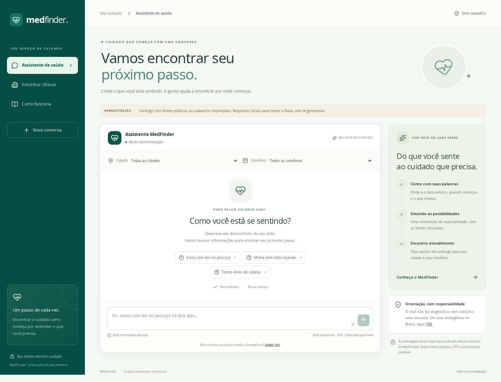
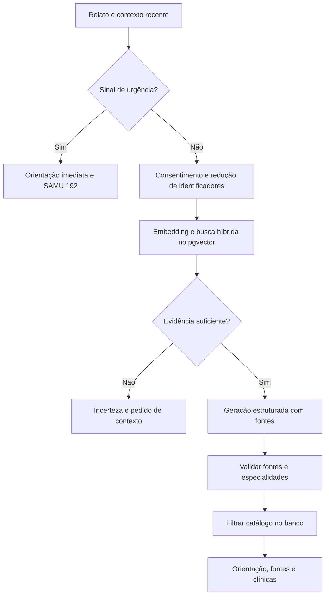

# MedFinder

Aplicação web para **navegação de cuidados**: a pessoa descreve uma queixa, consulta informações fundamentadas em uma base de conhecimento e encontra especialidades e clínicas do catálogo por cidade e convênio.

O projeto evolui o front React original para uma aplicação integrada em TypeScript. A identidade verde foi preservada, os componentes saíram de `public/` e o chat simulado foi substituído por uma API e um pipeline RAG.

> **Versão 1.3:** IA generativa e embeddings **locais com Ollama**, sem chave da OpenAI ou cobrança por mensagem. Mantém as **20 clínicas reais** e o RAG. A base médica de homologação ainda precisa de revisão clínica antes de uso assistencial.

**Quer usar sem API paga? Siga [docs/OLLAMA.md](docs/OLLAMA.md)**. Instale [Ollama](https://ollama.com/download/windows), abra o aplicativo e execute na pasta que contém `package.json`:

```powershell
ollama pull qwen3:4b-instruct-2507-q4_K_M
ollama pull bge-m3
npm.cmd ci
npm.cmd run setup:ollama
npm.cmd run dev
```

`setup:ollama` cria o `.env` automaticamente, prepara o RAG e testa os modelos. Abra **http://localhost:5173**. Os downloads dos dois modelos somam aproximadamente 3,7 GB; reserve memória e disco para o Ollama e o projeto. Depois dos downloads, chat/RAG/catálogo funcionam localmente. [Catálogo e fontes](docs/CATALOGO.md) · [OpenAI opcional](docs/ATIVACAO.md).



[Visualização em celular](docs/images/mobile.png) · [Arquitetura](docs/ARQUITETURA.md) · [API](docs/API.md) · [Operação](docs/OPERACAO.md)

## Demonstração sem instalar modelos

Requisitos: **Node.js 24 LTS** recomendado (mínimo 22.16), npm e Git.

Extraia o pacote entregue e abra um terminal na pasta `MedFinder`. Se estiver trabalhando no repositório original, aplique primeiro o patch conforme [docs/ENTREGA.md](docs/ENTREGA.md).

```bash
cd MedFinder
npm ci
cp .env.example .env
npm run dev
```

No PowerShell, use `npm.cmd` e substitua `cp .env.example .env` por `Copy-Item .env.example .env`. Copie o arquivo de configuração apenas quando ainda não tiver um `.env` configurado.

Abra **http://localhost:5173**. A API inicia na porta 3001. Na primeira execução, cria as tabelas, importa as 20 unidades reais e indexa os resumos de homologação automaticamente. Selecione **Fortaleza**, **CASSI** e envie **“estou com dor no pescoço”** para verificar chat, fontes, especialidades e a clínica compatível.

O banco local usa **PGlite**, PostgreSQL embarcado no processo Node, com **pgvector**, e persiste em `.data/postgres`. Não é um banco no navegador. Não exige Docker. Execute somente um processo de API ou CLI por vez quando usar esse diretório: pare `npm run dev` antes de comandos de manutenção.

O modo `AI_PROVIDER=demo` usa busca lexical/vetorial por feature hashing e respostas em modelo fixo. **Não contém um LLM local e não é IA generativa**. Serve para desenvolver, testar e demonstrar as conexões sem custo de API.

## Alternativa opcional: API OpenAI

1. Pare a aplicação.
2. No `.env`, altere:

   ```dotenv
   AI_PROVIDER=openai
   OPENAI_API_KEY=sua-chave-apenas-no-servidor
   OPENAI_MODEL=gpt-4.1-mini
   EMBEDDING_MODEL=text-embedding-3-small
   ```

3. Reindexe os documentos no mesmo modelo usado para as consultas:

   ```bash
   npm run setup:connected
   npm run integrations:check
   npm run dev
   ```

4. No chat, autorize o processamento do relato pela OpenAI. O serviço usa **Responses API + Structured Outputs**, `store: false` e embeddings de **1536 dimensões**. A interface distingue o catálogo real da base de orientação ainda sem revisão clínica.

A chave precisa ter acesso aos modelos e saldo/limites suficientes. A assinatura do ChatGPT não configura a API deste projeto. Não coloque a chave em variáveis `VITE_*`, no código, em commits ou no navegador. Toda troca de modelo de embeddings requer reindexação. Vetores de modelos diferentes não são misturados. O nome do modelo de geração é configurável; use um modelo compatível com Responses e Structured Outputs.

## Stack e organização

| Camada       | Tecnologia / responsabilidade                                                 |
| ------------ | ----------------------------------------------------------------------------- |
| Frontend     | React 19, TypeScript, Vite, CSS/Tailwind, Lucide; chat e catálogo responsivos |
| Contratos    | Zod compartilhado entre front e back                                          |
| API          | Node.js, Fastify; validação, CORS restrito, limites de payload e requisições  |
| Persistência | PostgreSQL 17 + pgvector; PGlite em desenvolvimento                           |
| RAG          | Ingestão de JSON, chunks com sobreposição, embeddings, busca híbrida e fontes |
| Geração      | Ollama local ou OpenAI com saída estruturada; demonstração explícita          |
| Qualidade    | Vitest, Playwright, TypeScript estrito, ESLint, Prettier, GitHub Actions      |

```text
src/                  interface, componentes, hooks e cliente HTTP
shared/contracts.ts   formatos validados e taxonomia de especialidades
server/app.ts         composição da API e controles HTTP
server/services/      orquestração do chat
server/domain/        alertas, normalização e redução de identificadores
server/ai/            contratos e adaptadores de IA
server/rag/           ingestão, chunking e recuperação
server/db/            conexão, migrações e catálogo
scripts/manage.ts     manutenção e importação via CLI
data/                catálogo real, fixtures e documentos de homologação
tests/               testes de regras, API, banco e contrato do provedor
e2e/                 fluxos completos no navegador
docs/                arquitetura, API, operação e limites conhecidos
```

## Fluxo RAG



As clínicas, convênios, endereços e contatos vêm **do banco**, e não de nomes inventados pelo modelo. IDs de fontes e especialidades são validados contra os trechos recuperados. Em alerta de urgência, o fluxo não mostra clínicas para consulta eletiva. Se a IA ou a busca falhar, a resposta informa indisponibilidade e não fabrica uma indicação.

## Cadastrar os dados reais

`data/clinics.public.json` contém **20 unidades em Fortaleza, Eusébio e Maracanaú**, consultadas em sites próprios em 24/09/2026. Abrange as nove especialidades do projeto. Não é uma lista nacional nem uma confirmação de parceria comercial, agenda ou cobertura individual. [Fontes e limitações](docs/CATALOGO.md).

```powershell
npm.cmd run catalog:load
```

Esse comando importa a versão local do catálogo, sem chave ou acesso à internet no modo `demo`. Não consulta os sites nem altera a data de verificação. Registros removidos da coleção são desativados, preservando cadastros manuais. As clínicas fictícias da instalação anterior são desativadas. Para atualizar os dados, revise o JSON nas fontes antes de reimportar.

Use `data/clinics.demo.json` e `data/knowledge.demo.json` como exemplos dos formatos. Não basta remover a marca de demonstração: o conteúdo, os vínculos de convênio e as fontes precisam ser verificados por responsáveis pelo projeto.

```bash
npm run db:migrate
npm run data:import -- clinics ./caminho/clinicas-verificadas.json
npm run data:import -- knowledge ./caminho/conhecimento-revisado.json
```

- **Clínicas:** `isDemo=false`, `sourceUrl` HTTPS, `verifiedAt` real e `active=true`. Convênios são correspondências de cadastro, não garantia de cobertura de todo produto da operadora. Cadastros públicos/manuais sem reverificação por 180 dias deixam de aparecer. Campos desconhecidos ficam nulos ou em listas vazias.
- **Conhecimento:** resumos autorizados, fonte, palavras-chave e especialidades. A publicação exige `reviewStatus=approved`, `reviewedBy`, `reviewedAt`, `isDemo=false` e `active=true`. Documentos com revisão superior a 365 dias saem da recuperação. A aplicação verifica metadados, **não certifica a habilitação do revisor**.
- A importação manual atualiza registros por `id`; reserve o prefixo `public-` para a coleção distribuída. Para retirar um item, importe o mesmo `id` com `active=false`. Documentos iguais não são reprocessados; a troca de conteúdo substitui os chunks em uma transação.
- A CLI é o canal administrativo: não há endpoint público de escrita nem painel com credenciais embutidas. Execute a CLI em um ambiente autorizado com acesso ao banco.
- Arquivos de conhecimento são lidos localmente. URLs de fontes não são baixadas automaticamente; não há crawling nem execução de instruções contidas nos documentos. Os sites de clínicas só são abertos quando a pessoa segue os links; nenhum relato é enviado a eles pelo backend.

Detalhes em [docs/OPERACAO.md](docs/OPERACAO.md).

## Docker e PostgreSQL externo

Para experimentar o conjunto com Docker:

1. Copie `.env.example` para `.env`.
2. Defina `POSTGRES_PASSWORD` com uma senha de desenvolvimento e `WEB_ORIGIN=http://localhost:3001`.
3. Execute `docker compose up --build`.
4. Abra **http://localhost:3001**. O backend também serve o front compilado.

Para produção, parta de `.env.production.example`. São obrigatórios PostgreSQL externo, um provedor generativo configurado (Ollama local ou OpenAI), `ALLOW_DEMO_DATA=false`, `AUTO_SEED=false` e origem HTTPS. Cadastre e revise o conteúdo antes de liberar o tráfego; `/api/ready` retorna 503 sem catálogo visível, sem documentos válidos ou com reindexação pendente. O Compose escuta somente no loopback do host: publique atrás de um proxy HTTPS. O banco não expõe porta ao host. Use senha com caracteres seguros em URL ou codifique os caracteres reservados ao montar `DATABASE_URL`.

Para executar sem Docker com banco já configurado:

```bash
npm ci
npm run db:migrate
npm run build
npm start
```

O servidor de produção usa `dist/` para servir o front e `build/` para a API, na mesma origem. Não use `vite preview` como servidor de produção. Não compartilhe `.data/` entre réplicas. Para múltiplas instâncias, use PostgreSQL externo e limites de uso compartilhados no gateway; o limitador atual é por processo.

## Comandos e testes

```bash
npm run check        # lint, TypeScript, build e testes de unidade/integração
npx playwright install chromium
npm run test:e2e     # navegador desktop e celular
npm run format:check
```

Os testes de integração usam PostgreSQL em memória via PGlite com pgvector real, e não um mock SQL. Os contratos OpenAI/Ollama são testados com transporte HTTP simulado; a execução não faz chamadas pagas. Não use esses resultados como prova de acurácia clínica. Consulte [docs/VALIDACAO.md](docs/VALIDACAO.md) para o escopo e os limites.

## Privacidade e limites

A aplicação não cria contas nem armazena conversas. O histórico fica na memória da aba; os últimos seis relatos acompanham a requisição para manter contexto. “Nova conversa” e recarregar a página removem esse histórico local. O backend não grava textos em tabelas ou logs de requisição. Há uma redução de CPF, e-mail e telefone antes do envio à IA, que **não garante anonimização** e não remove todas as informações identificáveis.

No modo Ollama, embeddings e geração são executados no computador do backend, sem chave e sem envio à OpenAI. O adaptador rejeita modelos cloud e não troca automaticamente de provedor. No modo OpenAI, embeddings e geração envolvem processamento pelo provedor. `store:false` não equivale a retenção zero de todos os sistemas do provedor. O consentimento técnico da interface não substitui a análise jurídica, a política de privacidade e os contratos necessários para operar com dados de saúde.

Não há agendamento, geolocalização automática, integração com operadoras, autenticação de pacientes ou ranking de qualidade médica. As sugestões respeitam os filtros informados. Antes de uso assistencial, são necessárias validação clínica independente, avaliação de segurança, governança dos dados, definição da finalidade regulatória e operação monitorada. Consulte [docs/ARQUITETURA.md](docs/ARQUITETURA.md).

## Referências de implementação

- [PGlite e pgvector](https://pglite.dev/extensions/)
- [Fastify](https://fastify.dev/docs/latest/)
- [OpenAI Structured Outputs](https://developers.openai.com/api/docs/guides/structured-outputs)
- [OpenAI embeddings](https://developers.openai.com/api/docs/guides/embeddings)
- [SAMU 192 — Ministério da Saúde](https://www.gov.br/saude/pt-br/composicao/saes/samu-192)

As referências específicas dos resumos demonstrativos estão em cada documento JSON. As associações de especialidades são editoriais, explicitadas nos textos, e não significam endosso do serviço de origem.
